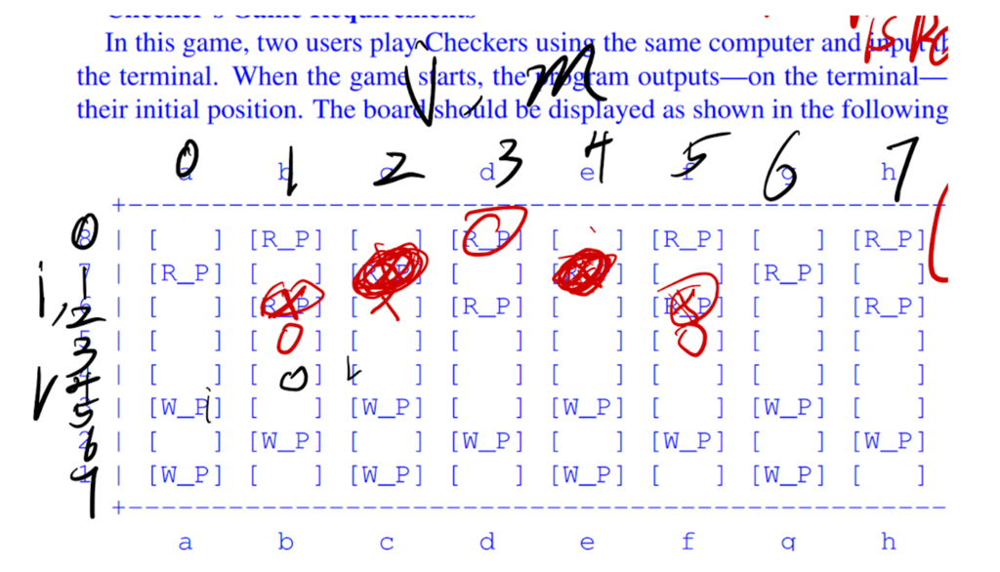

# The design Ideas for our project

We decide to divide our project into three class **CheckMan**,**Logic**,**Play**

## CheckMan

The function of this class is to store the information about position, color, status(king or pawn). And to achieve this, we design the information as a two-dimension integer array, in the form [[row, colum,color, status], [row,coloum, color, status]...], with 24 arrays, as there would be 24 CheckMan on the board, when one CheckMan is beaten by the opponent, we could change its (row, column) into (-9,-9), which means it's no longer on the board. And those CheckMan on the board will have a row and column ,both betwwen 0 and 7. 

The following image shows corresponding position for every row and colum.

When it comes to the movement of CheckMan. We would transform the input of play into the form(i,j,l,m), among which (i, j) means the starting place, (l, m) means the destination.

And the class is equipped with some functions to identify whether a CheckMan is onboard, is red or is king or not,etc, to better provide service for the class **Logic**

## Logic

In this class, we would implent how to identify whether a CheckMan can jump or just simple move. Besides, we need to check whether the destination can be arrived from the staring place (i.e. it's impossible that a CheckMan move from(a,3) to h(8) in one step). And if a player has a CheckMan which can jump rather move simply, our system would operate that jump automatically, of course, identify whether it could jump at the new position or not as well, if the anwser is yes, the system would operate the jump again, then loop again and over again. 

## Play

Our main process of game would execute in this class. We divide the game's process into 2 big steps, which contains several small steps. The first big step is that the red player start the game, which means the system would draw the chess board and check whether there is a red CheckMan can jump, if yes, the system would execute that jump and continue to check again at the new position, loop again and over again. If not, the system would ask the player to input his/her movement from the keyboard. 

Next, the **Play** class would make sure that the user's input is in the form  \[a-h][1-8]x\[a-h][1-8], with regular expression, if not , the system would ask user to input again and over again,until it's in the legal form. Once it get the input in leagl form, it would check whether there is a ongaming user's CheckMan and whether the destination could be arrived by this CheckMan, if both the anwser is yes, the **Play** class would do the corresponding movement for user by calling the methodes of **Logic**, of course, the **Logic** would call the methodes in CheckMan as well. Otherwise, it would finish and restart from asking the user to input again and check from the beginning(legal or illegal form), and loop again and over again.Then check whether the game is over or not..And when all is done, draw the updated draw board and it turns to the opponent player.

The 2nd step is the operation of the opponent player, which is in the same logic as described above, so we don't describe again.